################################################################
Neural network classification of AuxTel mount tracking failures.
################################################################

.. abstract::

   For each image taken by the AuxTel, the tracking performance of the mount is monitored and analyzed.  Typically the RMS tracking errors are small, less that 0.2 arcseconds.  However, there are several problems that can cause the tracking errors to exceed this.  In this work, I built a neural network classifier that classifies the types of tracking failures based on the FFT of the tracking errors.  This was applied to all of the AuxTel data for 2023.  I believe these techniques will be useful for the Simonyi telescope as well.

Introduction
================
Extensive work has been done over the last three years to understand and characterize the types of mount tracking failures that can occur with the AuxTel telescope.  For each image taken, a mount performance plot is made and is available on RubinTV.  A sample of one of these plots is shown in Figure 1.  There are several different ways in which the tracking errors can exceed the desired level, and these are discussed in the following sections.  The purpose of this work is to show an automated method for classifying the different types of tracking failures, so that these can be trended to see how well efforts to reduce the tracking errors are succeeding.

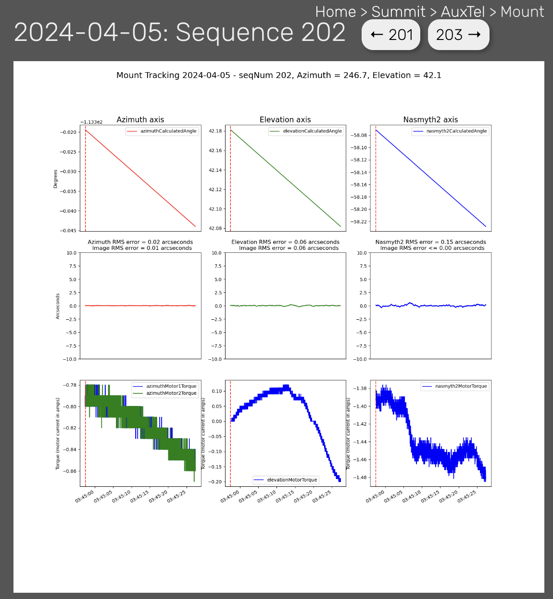

Figure 1.  A typical mount tracking performance plot.  The top row of plots shows the changes in the azimuth, elevation, and rotator values during the exposure.  The middle row shows the tracking errors.  These are obtained by fitting a 4th order polynomial to the top plot and plotting the deviations from the polynomial fit.  The bottom row of plots shows the torques from the drive motors.  Note that there are two azimuth drive motors.  Each of the three also shows the RMS tracking error, and the image degradation tracking error.   For the purpose of this work, RMS tracking errors less than 0.25 arcseconds are considered good, and RMS tracking errors greater than 0.25 arcseconds are considered tracking failures.

Types of tracking failures
===============================
This section explains the different types of mount tracking failures.  Figures 2-6 explain the different types.  For brevity, each type of failure is given a 3 letter designation.  In these plots, the mount tracking plot is shown on the top, and the FFT of the tracking errors is shown on the bottom.  The FFT of the tracking errors is fit with a spline with 18 spline knots.  The position of these knots will be input into a neural network based classifier to classify the different types of tracking failures.

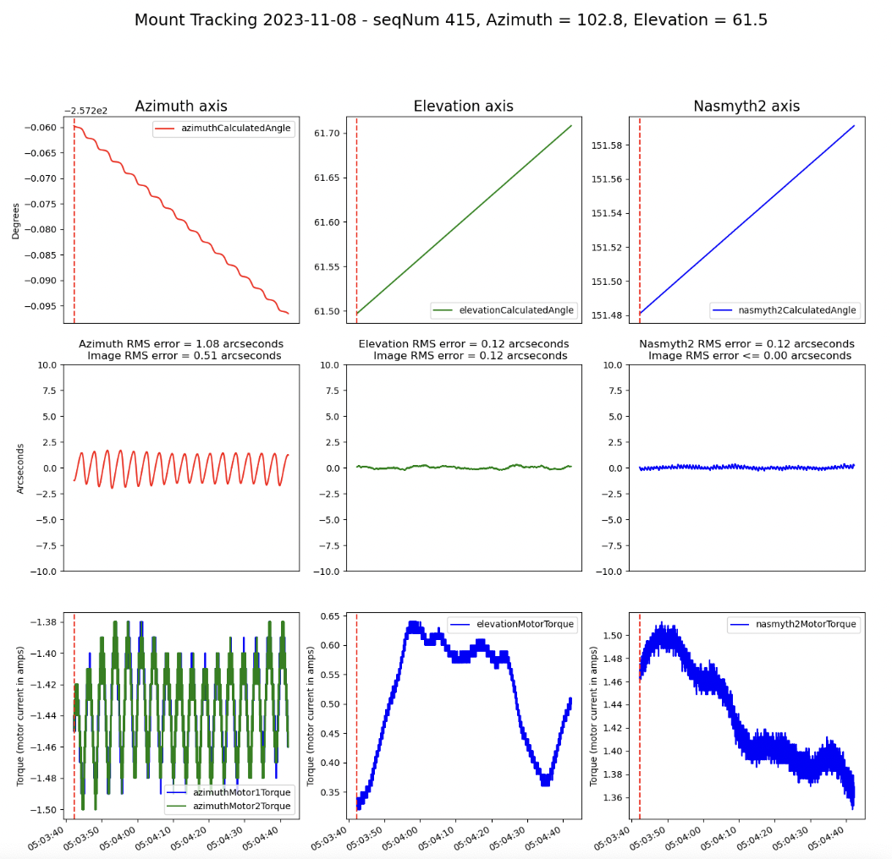

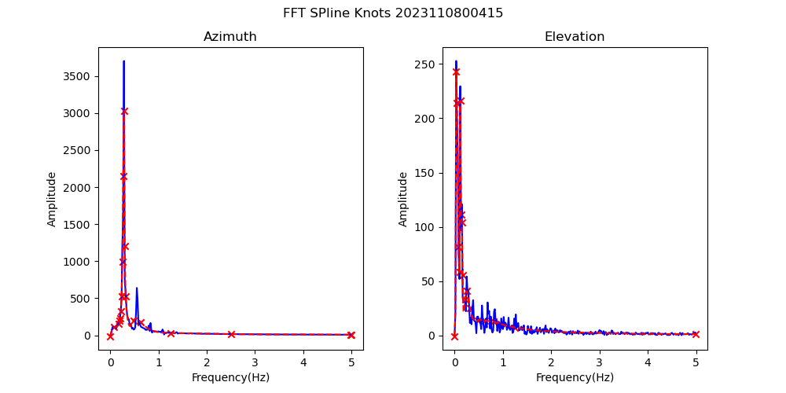

Figure 2.  OSC failures caused by azimuth drive oscillations. These only occur when the azimuth drive is moving slowly, typically less than 10 arcseconds/second.  These are predominantly in the south, and have been found to occur primarily after a slew in the negative direction. In November, 2023,  we implemented a "band-aid" fix  to slew past the object and return from the positive direction. We have been calling this "overslew", and it has been successful to significantly reduce the incidence of these failures.

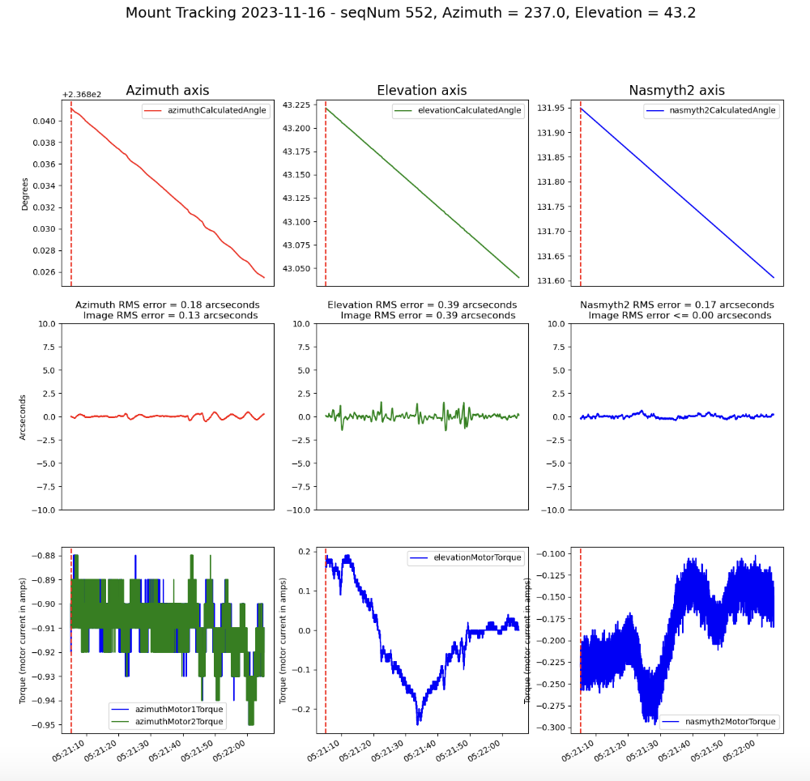

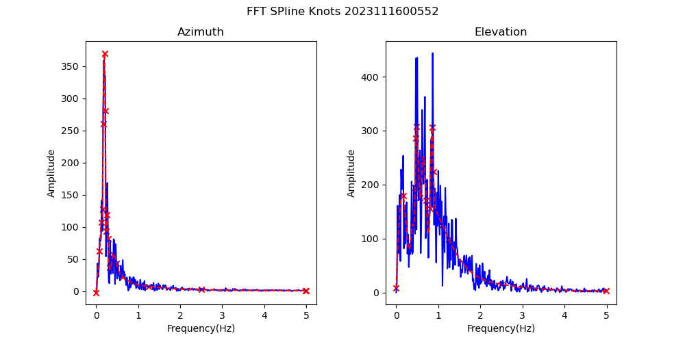

Figure 3.  WIN failures, caused by wind induced mount jitter. As will be seen later, these failures correlate strongly with wind speed.

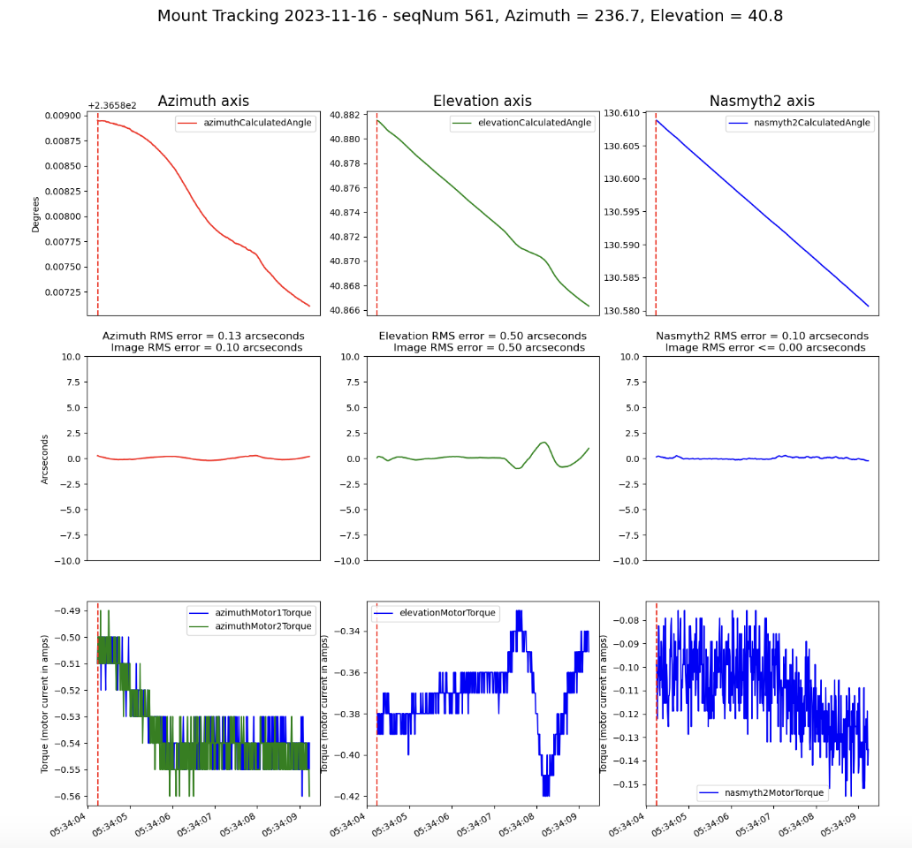

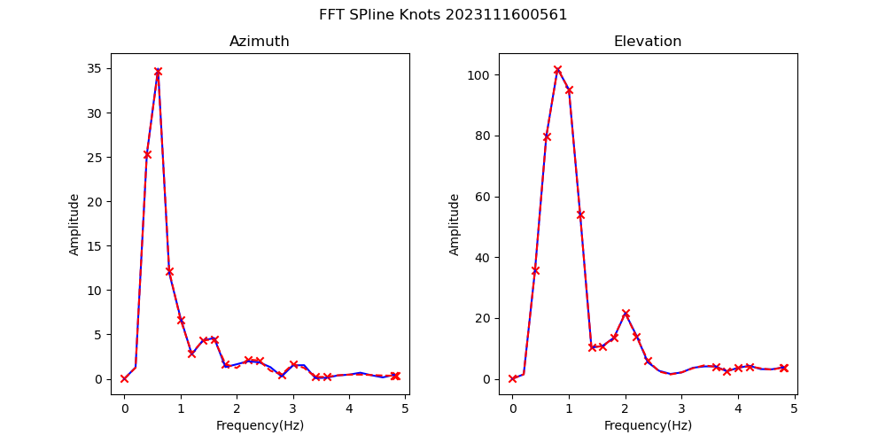

Figure 4.  CRA failures, also known as "crazy mount".  The cause of these failures is not known, but one hypothesis is that they are due to mount stiction.

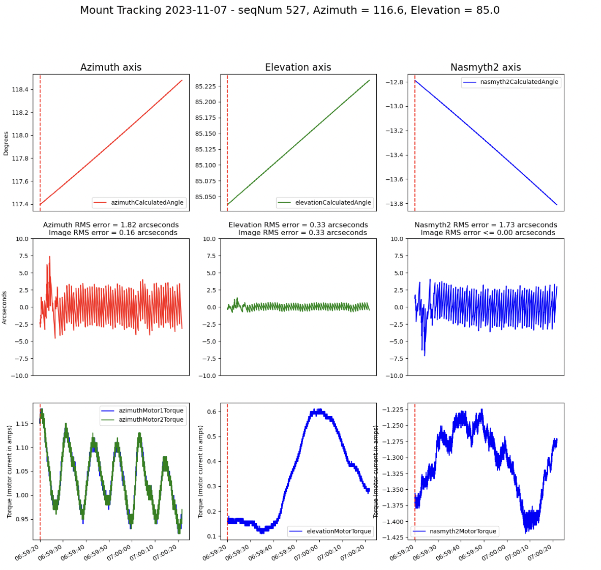

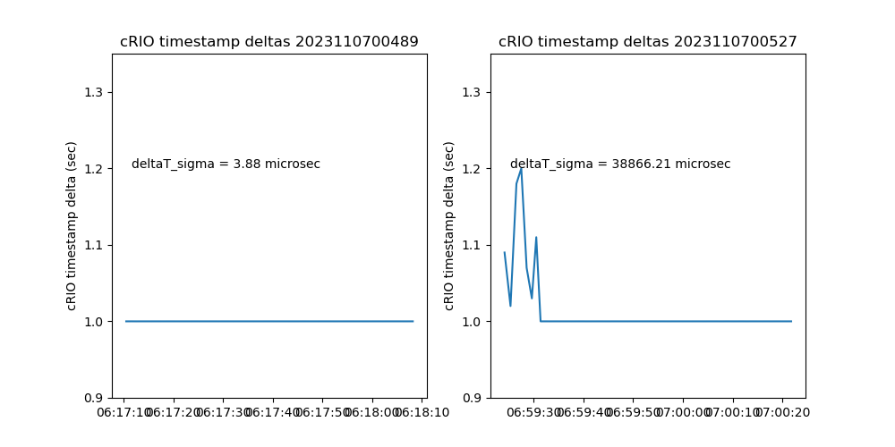

Figure 5. TIM failures, caused by cRIO timebase errors. The plot on the bottom shows the time between successive timestamps of the mount telemetry sent to the EFD.  When things are operating normally, the timestamps are accurately spaced one second apart, as shown in the  bottom left plot.  However, for unkown reasons, sometimes these timestamps are disrupted and can be as much as 1.3 seconds apart or more as shown on the bottom right.  These can be recognized because all three axes show deviations at the same times.  These can be easily identified by the large difference between successive cRIO timestamps.  So these are identified before the FFT results are fed to the classifier, and the classifier is not used to identify these failures. 

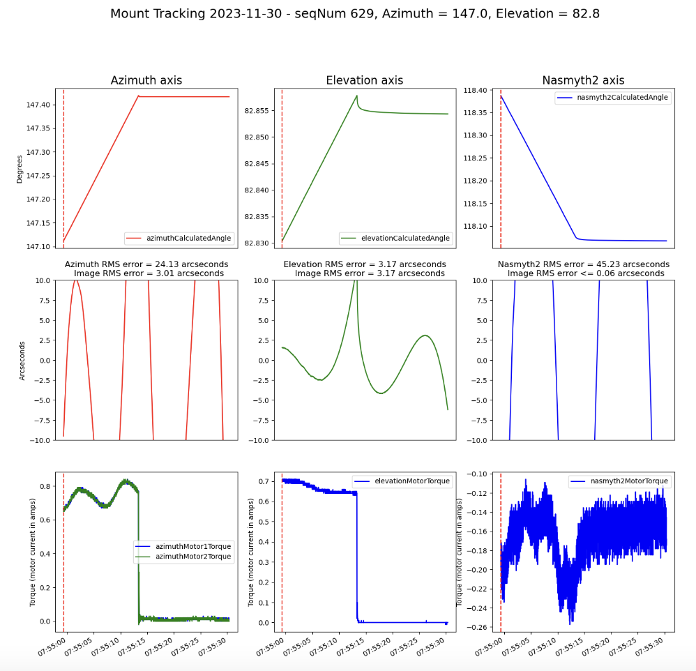

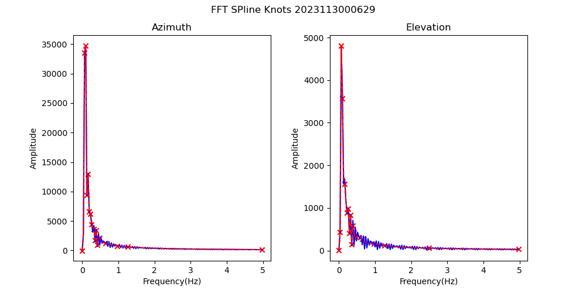

Figure 6.  SHU failures.  These are caused when the shutter opens while the mount is still slewing. Or, these can be caused by the mount faulting during the exposure, which causes the drives to stop tracking.

Building the neural network based classifier
===========================================================
As discussed above, for each tracking failure, the FFT of both the azimuth and elevation tracking errors are fit with a spline with 18 knots.  The location of the 36 knots (frequency and magnitude, so a total of 72 values) are then the input to the classifier.  The Python sklearn module is used to build and train the classifier.  I first trained the classfier with about 500 manually classfied mount error plots. I then split the training set into 80% training and 20% test.  After training the classifier with the 80% training set, the classfier classfied the 20% test set with a 96% success rate. The classifier was then retrained with the full training set.  The classfier was then run on all of the observing nights from 2023.  The results are shown in Figure 7.

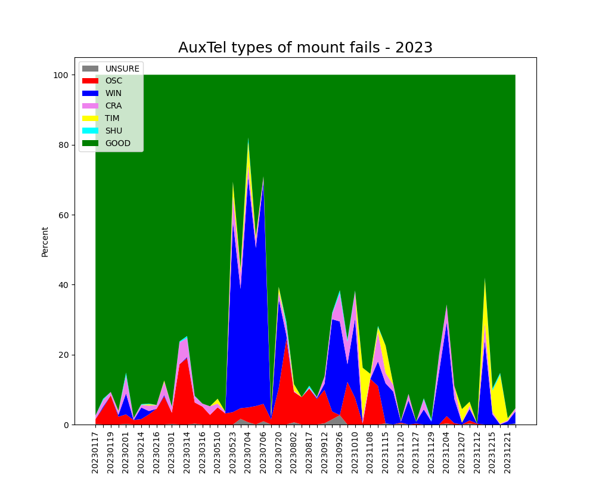

Figure 7.  The results of the classifier on all observing nights from 2023.  The OSC fails were largely eliminated with the "overslew'' fix on 20231115.  The TIM fails were first identified in November, 2023, but clearly were present as early as May, 2023.

WIN fails vs wind speed
=======================================
As a further check on the methodolgy and results, the WIN fails were correlated with wind speed (as measured by the weather tower).  The results are shown in Figure 8.  The strong correlation of WIN failures to wind speeds gives confidence that the failures are being classfied accurately.

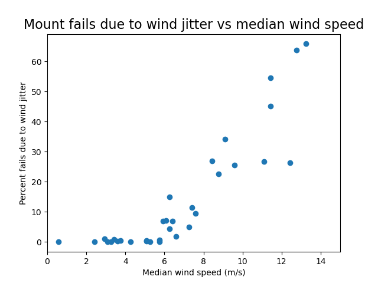

Figure 8.  The WIN failures correlate well with wind speed as measured by the weather tower.

Conclusions
=======================================
A neural netwrk based classifier has been constructed to classify AuxTel mount tracking failures by taking the FFT of the tracking errors.  This has been successful at automatically classifying the different types of mount tracking errors.  I believe this methodology will be applicable to the Simonyi telescope as well.

The software for building and applying the classifier is currently available at the following locations:

Base code for quantifying the FFT spline knots:

https://github.com/craiglagegit/Notebook_Keeper/blob/main/scripts/Classifying.py

Notebook for running the classification and plotting the results:

https://github.com/craiglagegit/Notebook_Keeper/blob/main/auxtel_notebooks/Classifying_AuxTel_Mount_Errors_02Jan24.ipynb
